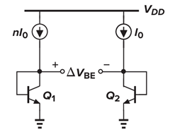
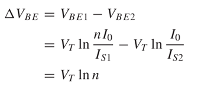
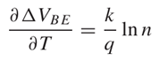
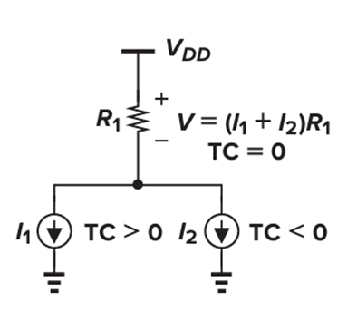
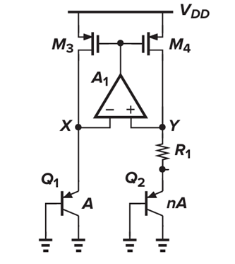
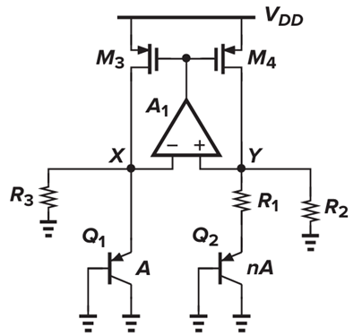
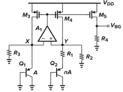
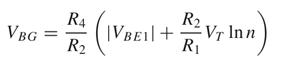

# Low-Voltage Bandgap Reference


## About

This project involves the design and implementation of a low-voltage bandgap reference circuit, a crucial component in analog IC design that provides stable, temperature-independent reference voltage for various applications.

## Overview

A low-voltage bandgap reference provides:
- Stable, temperature-independent reference voltage
- Operation at supply voltages near or below 1V
- Support for op-amps, ADCs, and DACs
- Essential functionality for low-power sensors and mobile systems

## Technical Details

The circuit works by:
- Combining CTAT (V_BE) and PTAT voltage
- Achieving near-zero temperature coefficient
- Operating at reduced supply voltage compared to traditional 1.4V designs
- Maintaining accuracy and stability at low voltages

## Applications

- Low-power sensors
- Mobile devices
- Embedded systems
- Modern CMOS technologies

# Table of Contents

1. [Introduction](#introduction)

2. [Overview of Bandgap Theory](#overview-of-bandgap-theory)

3. [Temperature-Independent References](#temperature-independent-references)
   - [3.1 Negative Temperature Coefficient](#31-negative-temperature-coefficient)

   - [3.2 Positive Temperature Coefficient](#32-positive-temperature-coefficient)

4. [Bandgap Reference](#bandgap-reference)
   - [4.1 Low-Voltage Bandgap Reference](#41-low-voltage-bandgap-reference)
   - [4.2 Reference Current](#42-reference-current)

5. [Circuit Design and Simulation Using Cadence Software](#circuit-design-and-simulation-using-cadence-software)
   - [5.1 Parameter Calculations](#51-parameter-calculations)
   - [5.2 Simulation Results](#52-simulation-results)

[CONCLUSION](#conclusion)

[REFERENCES](#references)

[APPENDIX](#appendix)


## Overview of Bandgap Theory

A bandgap reference circuit generates a stable, temperature-independent voltage used in most analog and mixed-signal ICs. The fundamental principle behind its operation involves:

- Combining two signals with opposite temperature coefficients (TC):
  - Positive Temperature Coefficient (PTAT)
  - Negative Temperature Coefficient (CTAT)
- Summing these voltages or currents and converting them through a resistor
- Resulting in a voltage that remains nearly constant over temperature

This approach enables the circuit to maintain voltage stability across varying temperature conditions, making it essential for precision analog applications.


## Temperature-Independent References

In analog circuits, reference voltages and currents with low temperature dependence play a crucial role in ensuring stable operation. The fundamental principle involves:

- Combining two quantities with opposite temperature coefficients (TC)
- Creating a reference voltage V_REF = α₁V₁ + α₂V₂ where:
  - V₁ and V₂ have opposite temperature variations
  - Coefficients α₁ and α₂ are chosen so α₁(∂V₁/∂T) + α₂(∂V₂/∂T) = 0

Bipolar Junction Transistors (BJTs) are preferred for bandgap references due to:
- High repeatability
- Stable thermal characteristics
- Ability to generate both positive and negative TC quantities

### 3.1 Negative Temperature Coefficient

In bandgap reference circuits, the base-emitter voltage (V_BE) of bipolar transistors, or more generally the forward voltage of pn junctions, exhibits a negative temperature coefficient (TC).

For a bipolar transistor, the collector current equation leads to:

V_BE = V_T ln(I_C/I_S)

where:
- I_S is the saturation current
- I_S increases with temperature
- This causes V_BE to decrease with temperature

The temperature coefficient of V_BE can be calculated by temperature derivative:
- At V_BE = 750mV and T = 300K
- ∂V_BE/∂T ≈ -1.5 mV/K

This negative TC characteristic, where V_BE decreases by -1.5 mV/K as temperature rises, can be combined with a positive TC to create a temperature-independent voltage reference.


### 3.2 Positive Temperature Coefficient


The generation of PTAT (Proportional To Absolute Temperature) voltage is achieved through the difference in base-emitter voltages (ΔV_BE) of two bipolar transistors operating at different current densities. This voltage difference exhibits a positive temperature coefficient.

Key characteristics:
- Two BJTs (Q1 and Q2) with equal saturation currents (I_S1 = I_S2)
- Different collector currents:
  - Q1: nI_0
  - Q2: I_0
  - Where n is a constant ratio

The voltage difference ΔV_BE is proportional to absolute temperature:

- ΔV_BE = V_T ln(n)
- As temperature increases, V_T increases
- This causes ΔV_BE to increase proportionally

The temperature coefficient of ΔV_BE can be calculated through temperature derivative, showing a positive relationship with temperature changes.


## Bandgap Reference

Using the negative-TC and positive-TC voltages discussed above, we can develop a zero temperature coefficient reference circuit.

The fundamental equation is:
```
V_ref = α₁V_BE + α₂(V_T ln(n))
```

Where:
- ∂V_BE/∂T ≈ -1.5 mV/K (negative TC)
- ∂V_T/∂T ≈ +0.087 mV/K (positive TC)
- For α₁ = 1, we get α₂ln(n) ≈ 17.2

This results in:
```
V_ref ≈ V_BE + 17.2V_T
     ≈ 1.25V
```

Key considerations:
- Traditional bandgap voltage is typically 1.2-1.25V
- This voltage was suitable for older high-voltage technologies
- Modern CMOS processes operate at 1.0-1.2V supply
- The 1.25V bandgap exceeds operating margins
- This creates design challenges in modern low-voltage applications

This voltage limitation drives the need for low-voltage bandgap reference designs.

### 4.1 Low-Voltage Bandgap Reference

This design uses a current-mode approach suitable for low-voltage applications. The core concept involves:


1. **Basic Operation**:
- Combines PTAT and CTAT currents
- Sum of currents through a resistor generates reference voltage
- Results in temperature-independent output voltage

2. **Core Circuit Structure** (Figure 2a): 
- BJTs Q1 and Q2 with different emitter areas (ratio n)
- Amplifier A1 adjusts M3 and M4 gate voltages
- Balances voltages VX and VY to generate specific TC currents

3. **Key Equations**:
```
V_BE1 = V_BE2 + |I_D4|R_1
V_T ln(I_D3/I_S1) = V_T ln(I_D4/I_S2) + |I_D4|R_1
|I_D4|R_1 = V_T ln(n)
```

4. **Temperature Independence** (Figure 2b): 
- Addition of R2, R3 resistors from points X, Y to ground
- Based on Banba's architecture for low-voltage design
- Minimum VDD requirements
- Key relationships:
  ```
  V_X ≈ V_Y ≈ |V_BE1|
  I_D3 = I_D4
  I_C1 + |V_BE1|/R3 = I_C2 + |V_BE2|/R2
  ```

This implementation achieves stable performance while operating at lower supply voltages compared to traditional bandgap references.

### 4.2 Reference Current


### 4.2 Reference Current

After achieving stable ID4 current, this reference is mirrored through ID5 to generate the output voltage VBG. The process involves:


1. **Temperature Independence**:
- Setting (R2/R1)·VT·ln(n) ≈ 17.2VT
- This makes temperature coefficient (TC) of ID4 = 0
- Ensures stable current reference across temperature range

2. **Current Mirroring**:
- ID4 is copied through M5
- Generated voltage has TC = 0
- Output voltage can be lower than traditional 1.25V limit

3. **Advantages**:
- Flexible output voltage scaling
- Maintains temperature stability
- Operates below conventional bandgap voltage limits
- Suitable for modern low-voltage applications

The final output voltage VBG achieves temperature independence while allowing operation at reduced supply voltages through careful selection of resistance ratios and current mirroring.